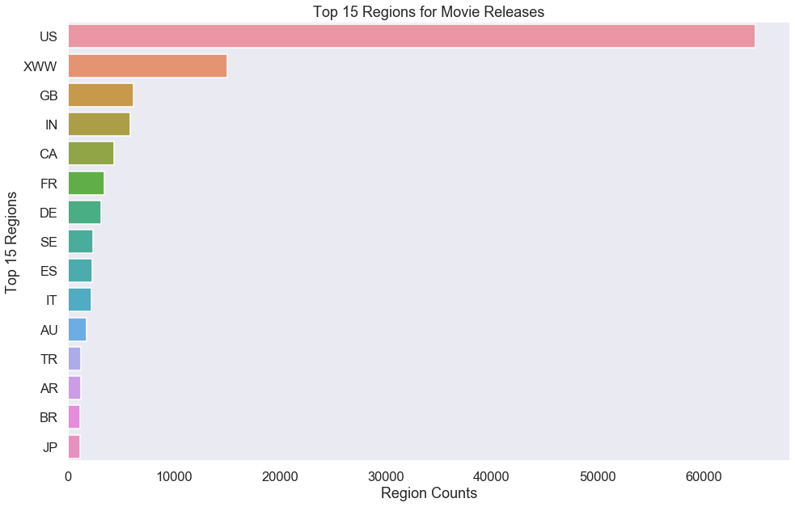

# An Analysis on Movie Creation and the Movie Industry

## Purpose
The purpose of this analysis is to obtain trends and insights from current film industry data in order to set my client, Microsoft, up for success upon entry into the field. 

## Description of Data
* imdb.name.basics.csv.gz
    *  Provides the professional roles (actor, composer, cinematographer, etc.) and names of the individuals behind certain film projects listed in the "known_for_titles" column, with their death and birth years included.
* bom.movie_gross.csv.gz
    * Contains the actual movie titles for popular movies, the year of release, the studios who released them, and the amount of money they grossed domestically and abroad.
* imdb.title.akas.csv.gz
    * Provides the titles amd title ids for select films, as well as the region and language they were released in, and key attributes of each film.
* rt.movie_info.csv.gz
    * Reveals the synopses, ratings and genres for films, along with their writer-director pairings. In addition we see the length of each film in the "runtime" column, and dates that the movie was released in theaters and to dvd. The currency and box office performance were included as well.
* imdb.title.prinicipals.csv.gz
    * Contains the movie title codes for popular movies, jobs that were involved in the making and filming of the movie, and the characters they played in those movies if applicable.
* Imdb.title.ratings.csv.gz
    * Shows the average viewer rating and numner of upvotes per movie title (code)
* rt.reviews.tsv.gz
    * Provides the rotten tomatoes data such as, critics, reviews, and "fresh" score per film.
* tn.movie_budgets.csv.gz
    * Reveals the production budget and domestic & worldwide gross sales per each film title.
* tmdb.movies.csv.gz
    * Gives the assigned genre ids and release dates per movie.
* imdb.title.crew.csv.gz
    *  Shows the writers and directors involved in each movie by title code.

 ## Areas of Interest
### Question 1: Does the Length of a Movie Have on its Popularity/Ratings?
####Tables Used: 
* Imdb.title.ratings.csv.gz 
* imdb.title.akas.csv.gz

####Exploratory Data Anaylsis (EDA)
The graph below explores factors that could potentially contribute to movie reviews outside of production quality and plot, like the runtime of the movie.

**Findings** 
The covariance between movie runtime and average viewer ratings is -2.02 and the Pearson correlation coefficient in between average ratings and time is -0.082. Both are negative and approach zero which tells us that the two variables have a near negligible effect on each other.

**Recommendations & Insights** 
Movie run times whether long or short have little to no effect on the ratings left by movie viewers. Microsoft can take the liberty to make shorts, and/or lengthy documentaries without fear of sacrificing quality content. 

### Question 2: Does a Larger Production Budget Equate to a Higher Gross?
####Table Used:
* tn.movie_budgets.csv.gz 

####Exploratory Data Anaylsis (EDA)
The graph below shows the relationship between Production Budget vs. Domestic Gross Sales, Production Budget & Worldwide Gross Sales, and Domestic Gross Sales vs. Worldwide Gross Sales.

**Findings**
Production Budget & Domestic Gross is 0.685, having a low correlation, whereas the correlation coefficient (r) for Production Budget & Worldwide Gross is 0.748, a mid to high correlation. Meaning that a change in production budget results in an almost similar change in worldwide gross. The correlation coefficient for Domestic Gross & Worldwide Gross is 0.938. This means that they have a high positive correlation.

**Recommendations & Insights**
The difference in r between Production Budget & Domestic Gross Sales and Production Budget & Worldwide Gross Sales indicates that international audiences may care more about things such as “big name” actors and actresses, production quality, etc. than domestic audiences who may just be attending a movie for the plot/storyline or genre.

The high positive correlation between 
Domestic Gross & Worldwide Gross tell us if a film is successful domestically, there is a high probability that the film will also do well abroad with foreign audiences, and if a film does poorly domestically, then failure abroad can be expected, and foreign release should be reconsidered with return on investment in mind.

### Question 3: What Regions are Movie Studios Targeting for Film Releases?
####Table Used: 
* imdb.title.akas.csv.gz

####Exploratory Data Anaylsis (EDA)
The graph below unvails the Top 15 regions where studios have released popular films.

**Findings**
The top 5 regions where movie studios have released popular movies are:
1. US (United States)
2. XWW (IMDB code referring various worldwide territories, not explicity called out)
3. GB (Great Britain)
4. IN (India)
5. CA (Canada)

**Recommendations & Insights**
If Microsoft follows the blueprint, release patterns, and promo of existing major studios, then they will see similar success. Alternatively if Microsoft were looking to render their potential movie studio competitors irrelevant, they should avoid these top target countries, and focus on serving smaller, niche markets.

